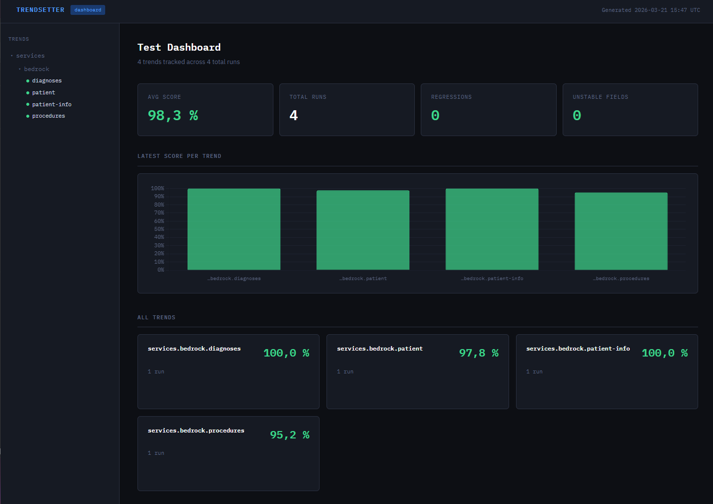
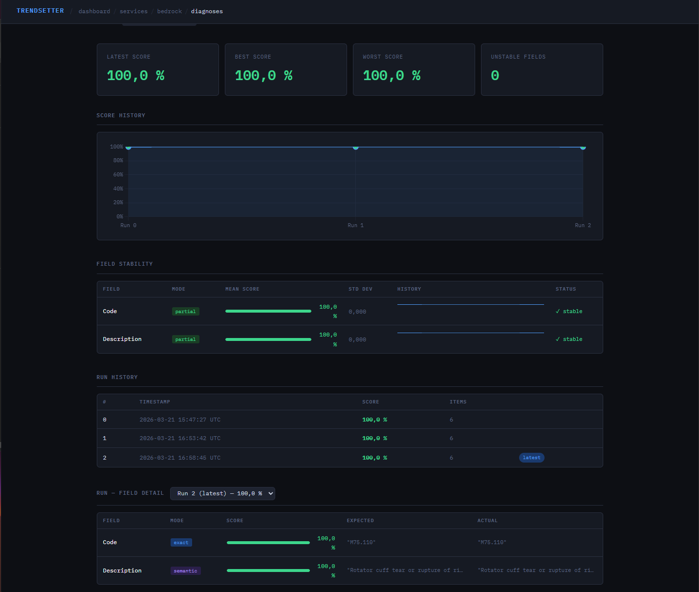
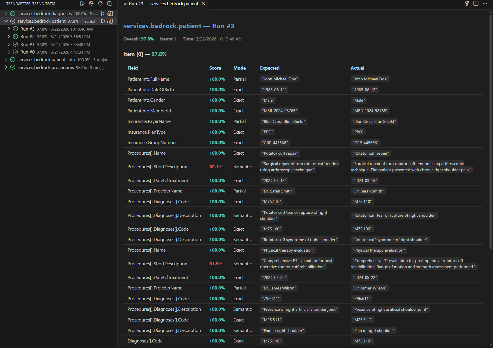

# Trendsetter

A multi-model trend testing and scoring framework for measuring AI extraction quality over time. Compare expected (ground truth) vs actual (AI-extracted) data using configurable field-level scoring — then track regressions, improvements, and stability across runs with auto-generated HTML dashboards.

## Table of Contents

- [Overview](#overview)
- [Getting Started](#getting-started)
- [Core Concepts](#core-concepts)
    - [Scoring Modes](#scoring-modes)
    - [Configuration DSL](#configuration-dsl)
    - [Trend Tests](#trend-tests)
    - [Module Registry](#module-registry)
- [Examples](#examples)
    - [1. Simple Flat Model](#1-simple-flat-model)
    - [2. Nested Objects with OwnsOne](#2-nested-objects-with-ownsone)
    - [3. Collections with OwnsMany](#3-collections-with-ownsmany)
    - [4. Deep Nesting (Objects Inside Collections)](#4-deep-nesting-objects-inside-collections)
    - [5. Default Scoring Mode](#5-default-scoring-mode)
    - [6. Skipping Fields](#6-skipping-fields)
    - [7. Semantic Scoring with Custom Encoder](#7-semantic-scoring-with-custom-encoder)
    - [8. Running a Trend Test](#8-running-a-trend-test)
    - [9. Using the Module Registry](#9-using-the-module-registry)
    - [10. Scoring Without a TrendTest](#10-scoring-without-a-trendtest)
- [Reporting](#reporting)
    - [Automatic HTML Reports](#automatic-html-reports)
    - [CLI Commands](#cli-commands)
    - [Directory Layout](#directory-layout)
- [Running via dotnet test](#running-via-dotnet-test)
- [VS Code Extension](#vs-code-extension)
    - [Installation](#installation)
    - [Sidebar Tree View](#sidebar-tree-view)
    - [Running & Stopping Tests](#running--stopping-tests)
    - [Commands](#commands)
- [Architecture](#architecture)
- [Project Structure](#project-structure)

---

## Overview

Trendsetter solves a critical problem in AI-powered data extraction: **how do you know your AI is getting better (or worse) over time?**

It provides:

- A **fluent configuration DSL** (inspired by EF Core) to define how each field should be scored
- **Five scoring modes** — Exact, Partial, Semantic, Structural, Skip
- **Recursive scoring** across nested objects and collections with greedy best-match alignment
- **Trend analysis** with per-field statistics, stability detection, and regression/improvement tracking
- **HTML dashboard generation** with Chart.js visualizations

## Getting Started

### Prerequisites

- .NET 9.0 SDK or later

### Installation

Add a project reference to the engine:

```xml
<ProjectReference Include="path/to/Trendsetter.Engine.csproj" />
```

The engine has **zero external dependencies** — it's a pure .NET 9 class library.

### Quick Start

```csharp
using Trendsetter.Engine.Builders;
using Trendsetter.Engine.Models;
using Trendsetter.Engine.Scorers;

// 1. Define your model
public record Product(string Name, string Description, decimal Price);

// 2. Configure scoring
var builder = new TrendModelBuilder<Product>();
builder
    .Property(x => x.Name).HasScoringMode(ScoringMode.Exact)
    .Property(x => x.Description).HasScoringMode(ScoringMode.Partial)
    .Property(x => x.Price).HasScoringMode(ScoringMode.Exact);

// 3. Score expected vs actual
var scorer = new ModelScorer(new ScorerFactory());
var expected = new Product("Widget", "A small blue widget for assembly", 9.99m);
var actual   = new Product("Widget", "A small widget used in assembly", 10.99m);

var result = scorer.Score(expected, actual, builder.Configuration);

Console.WriteLine($"Overall: {result.Score:P1}");
foreach (var field in result.FieldScores)
    Console.WriteLine($"  {field.FieldName}: {field.Score:P1} ({field.Mode})");
```

Output:

```
Overall: 77.8%
  Name: 100.0% (Exact)
  Description: 83.3% (Partial)
  Price: 0.0% (Exact)
```

---

## Core Concepts

### Scoring Modes

Each field is scored using one of five modes:

| Mode           | Algorithm                        | Best For                           | Score Range |
| -------------- | -------------------------------- | ---------------------------------- | ----------- |
| **Exact**      | Case-insensitive string equality | IDs, codes, dates, booleans, enums | 0 or 1      |
| **Partial**    | F1 score on tokenized word sets  | Names, short text, addresses       | 0.0 – 1.0   |
| **Semantic**   | Cosine similarity via embeddings | Descriptions, summaries, free text | 0.0 – 1.0   |
| **Structural** | Jaccard index on token sets      | JSON arrays, lists, tags           | 0.0 – 1.0   |
| **Skip**       | Always returns 1.0               | Fields to exclude from scoring     | Always 1.0  |

#### Auto-Detection

If you don't specify a mode, the engine auto-detects based on CLR type:

- `int`, `long`, `double`, `decimal`, `bool`, `DateTime`, `DateOnly`, enums → **Exact**
- `string` → uses the configured **default mode** (Partial by convention)
- `IEnumerable<T>` → **Structural**

### Configuration DSL

The fluent builder API mirrors EF Core's `ModelBuilder` pattern:

```csharp
public class ProductConfiguration : ITrendConfiguration<Product>
{
    public void Configure(TrendModelBuilder<Product> builder)
    {
        builder
            .Property(x => x.Name).HasScoringMode(ScoringMode.Exact)
            .Property(x => x.Description).HasScoringMode(ScoringMode.Semantic)
            .Property(x => x.Price).HasScoringMode(ScoringMode.Exact);
    }
}
```

#### Builder Methods

| Method                                        | Purpose                                                         |
| --------------------------------------------- | --------------------------------------------------------------- |
| `Property(x => x.Field).HasScoringMode(mode)` | Set scoring mode for a scalar property                          |
| `Property(x => x.Field).Skip()`               | Exclude a field from scoring (shorthand for `ScoringMode.Skip`) |
| `OwnsOne(x => x.Nav, cfg => { ... })`         | Configure scoring for a nested single object                    |
| `OwnsMany(x => x.Collection, cfg => { ... })` | Configure scoring for a nested collection                       |
| `HasDefaultScoringMode(mode)`                 | Set the fallback mode for unconfigured fields                   |

### Trend Tests

`TrendTest<TModel, TResponse>` is the base class for defining repeatable AI extraction tests:

```csharp
public abstract class TrendTest<TModel, TResponse>
{
    // Define field scoring rules
    public abstract void Configure(TrendModelBuilder<TModel> builder);

    // Return ground truth data
    public abstract Task<TResponse> GetExpectedAsync();

    // Call your AI service and return extracted data
    public abstract Task<TResponse> GetActualAsync();

    // Orchestrates everything: configure → extract → score → return RunResult
    public async Task<RunResult> RunAsync(RunResult[]? history = null);
}
```

The test is automatically identified by its fully qualified class name (e.g. `Trendsetter.Trends.Trends.Services.ProceduresTrendTest`). There is no need to declare a `TestId` — it is derived from `GetType().FullName`.

`TResponse` can be either:

- `TModel` — for single-object extraction
- `IReadOnlyList<TModel>` — for collection extraction (items are greedy-matched by best score)

### Module Registry

The `Module` class provides a central registry for scoring configurations:

```csharp
var module = new Module();

// Register by instance
module.Register(new ProductConfiguration());

// Register by type
module.Register<ProductConfiguration, Product>();

// Auto-scan an assembly for all ITrendConfiguration implementations
module.RegisterFromAssembly(typeof(ProductConfiguration).Assembly);

// Retrieve configuration
var config = module.GetConfiguration<Product>();
```

---

## Examples

### 1. Simple Flat Model

Score a flat record with no nesting:

```csharp
public record Invoice(string InvoiceNumber, string Vendor, decimal Amount, DateOnly Date);

public class InvoiceConfiguration : ITrendConfiguration<Invoice>
{
    public void Configure(TrendModelBuilder<Invoice> builder)
    {
        builder
            .Property(x => x.InvoiceNumber).HasScoringMode(ScoringMode.Exact)
            .Property(x => x.Vendor).HasScoringMode(ScoringMode.Partial)
            .Property(x => x.Amount).HasScoringMode(ScoringMode.Exact)
            .Property(x => x.Date).HasScoringMode(ScoringMode.Exact);
    }
}

// Score
var builder = new TrendModelBuilder<Invoice>();
new InvoiceConfiguration().Configure(builder);

var scorer = new ModelScorer(new ScorerFactory());
var result = scorer.Score(
    new Invoice("INV-001", "Acme Corporation", 1500.00m, new DateOnly(2025, 1, 15)),
    new Invoice("INV-001", "Acme Corp",        1500.00m, new DateOnly(2025, 1, 15)),
    builder.Configuration
);

// result.Score → ~0.83  (Vendor partially matched, everything else exact)
```

### 2. Nested Objects with OwnsOne

Score models with nested owned objects — field names are flattened with dot notation (e.g. `Address.City`):

```csharp
public record Address(string Street, string City, string ZipCode);
public record Customer(string Name, string Email, Address Address);

public class CustomerConfiguration : ITrendConfiguration<Customer>
{
    public void Configure(TrendModelBuilder<Customer> builder)
    {
        builder
            .Property(x => x.Name).HasScoringMode(ScoringMode.Partial)
            .Property(x => x.Email).HasScoringMode(ScoringMode.Exact)
            .OwnsOne(x => x.Address, addr =>
            {
                addr.Property(x => x.Street).HasScoringMode(ScoringMode.Partial);
                addr.Property(x => x.City).HasScoringMode(ScoringMode.Exact);
                addr.Property(x => x.ZipCode).HasScoringMode(ScoringMode.Exact);
            });
    }
}
```

Result field names: `Name`, `Email`, `Address.Street`, `Address.City`, `Address.ZipCode`

### 3. Collections with OwnsMany

Score models with collections — items are greedy-matched by highest score, and field names use bracket notation (e.g. `Diagnoses[].Code`):

```csharp
public record Diagnosis(string Code, string Description);
public record Procedure(string Name, DateOnly Date, IReadOnlyList<Diagnosis> Diagnoses);

public class ProcedureConfiguration : ITrendConfiguration<Procedure>
{
    public void Configure(TrendModelBuilder<Procedure> builder)
    {
        builder
            .Property(x => x.Name).HasScoringMode(ScoringMode.Exact)
            .Property(x => x.Date).HasScoringMode(ScoringMode.Exact)
            .OwnsMany(x => x.Diagnoses, dx =>
            {
                dx.Property(x => x.Code).HasScoringMode(ScoringMode.Exact);
                dx.Property(x => x.Description).HasScoringMode(ScoringMode.Semantic);
            });
    }
}
```

The engine builds an N×M score matrix between expected and actual items, then uses greedy assignment to find the best match for each expected item.

### 4. Deep Nesting (Objects Inside Collections)

Combine `OwnsOne` and `OwnsMany` at any depth:

```csharp
public record PatientInfo(string FullName, string DateOfBirth, string Gender, string MemberId);
public record Insurance(string PayerName, string PlanType, string GroupNumber);
public record Patient(
    PatientInfo PatientInfo,
    Insurance Insurance,
    IReadOnlyList<Procedure> Procedures,
    IReadOnlyList<Diagnosis> Diagnoses);

public class PatientConfiguration : ITrendConfiguration<Patient>
{
    public void Configure(TrendModelBuilder<Patient> builder)
    {
        builder
            .OwnsOne(x => x.PatientInfo, pi =>
            {
                pi.Property(x => x.FullName).HasScoringMode(ScoringMode.Partial);
                pi.Property(x => x.DateOfBirth).HasScoringMode(ScoringMode.Exact);
                pi.Property(x => x.Gender).HasScoringMode(ScoringMode.Exact);
                pi.Property(x => x.MemberId).HasScoringMode(ScoringMode.Exact);
            })
            .OwnsOne(x => x.Insurance, ins =>
            {
                ins.Property(x => x.PayerName).HasScoringMode(ScoringMode.Partial);
                ins.Property(x => x.PlanType).HasScoringMode(ScoringMode.Exact);
                ins.Property(x => x.GroupNumber).HasScoringMode(ScoringMode.Exact);
            })
            .OwnsMany(x => x.Procedures, proc =>
            {
                proc.Property(x => x.Name).HasScoringMode(ScoringMode.Exact);
                proc.Property(x => x.Date).HasScoringMode(ScoringMode.Exact);
                proc.OwnsMany(x => x.Diagnoses, dx =>
                {
                    dx.Property(x => x.Code).HasScoringMode(ScoringMode.Exact);
                    dx.Property(x => x.Description).HasScoringMode(ScoringMode.Semantic);
                });
            })
            .OwnsMany(x => x.Diagnoses, dx =>
            {
                dx.Property(x => x.Code).HasScoringMode(ScoringMode.Exact);
                dx.Property(x => x.Description).HasScoringMode(ScoringMode.Semantic);
            });
    }
}
```

Result field names: `PatientInfo.FullName`, `Insurance.PayerName`, `Procedures[].Name`, `Procedures[].Diagnoses[].Code`, `Diagnoses[].Description`, etc.

### 5. Default Scoring Mode

Set a fallback mode for any field not explicitly configured:

```csharp
public class LooseConfiguration : ITrendConfiguration<Product>
{
    public void Configure(TrendModelBuilder<Product> builder)
    {
        builder
            .HasDefaultScoringMode(ScoringMode.Partial)
            .Property(x => x.Name).HasScoringMode(ScoringMode.Exact);
        // Description and Price will use Partial (the default)
    }
}
```

Without `HasDefaultScoringMode`, the engine uses auto-detection based on CLR type.

### 6. Skipping Fields

Exclude fields from scoring entirely:

```csharp
public class SelectiveConfiguration : ITrendConfiguration<Invoice>
{
    public void Configure(TrendModelBuilder<Invoice> builder)
    {
        builder
            .Property(x => x.InvoiceNumber).HasScoringMode(ScoringMode.Exact)
            .Property(x => x.Vendor).HasScoringMode(ScoringMode.Partial)
            .Property(x => x.Amount).Skip()   // ignored in scoring
            .Property(x => x.Date).Skip();     // ignored in scoring
    }
}
```

### 7. Semantic Scoring with Custom Encoder

Plug in your own embedding provider for true semantic comparison:

```csharp
using Trendsetter.Engine.Scorers;

public class MyEmbeddingEncoder : ISentenceEncoder
{
    public float[] Encode(string text)
    {
        // Call OpenAI, AWS Bedrock, ML.NET, ONNX, or any embedding API
        return MyEmbeddingApi.GetEmbedding(text);
    }
}

// Wire it into the scorer factory
var factory = new ScorerFactory(encoder: new MyEmbeddingEncoder());
var scorer = new ModelScorer(factory);

// Now ScoringMode.Semantic uses cosine similarity on real embeddings
var result = scorer.Score(expected, actual, config);
```

Without an encoder, `Semantic` mode gracefully falls back to `Partial` (F1 token matching).

### 8. Running a Trend Test

Create a full trend test that runs against an AI service:

```csharp
public class ProceduresTrendTest : TrendTest<Procedure, IReadOnlyList<Procedure>>
{
    private readonly IAiService _aiService;

    public ProceduresTrendTest(IAiService aiService)
        => _aiService = aiService;

    public override void Configure(TrendModelBuilder<Procedure> builder)
    {
        new ProcedureConfiguration().Configure(builder);
    }

    public override Task<IReadOnlyList<Procedure>> GetExpectedAsync()
    {
        return Task.FromResult<IReadOnlyList<Procedure>>([
            new Procedure("Rotator cuff repair", new DateOnly(2024, 3, 15), [
                new Diagnosis("M75.110", "Rotator cuff tear of right shoulder"),
            ]),
        ]);
    }

    public override async Task<IReadOnlyList<Procedure>> GetActualAsync()
    {
        return await _aiService.ExtractProceduresAsync(documentText);
    }
}

// Run the test
var test = new ProceduresTrendTest(aiService);
var result = await test.RunAsync();

Console.WriteLine($"Score: {result.Score:P1}");  // e.g. "Score: 95.2%"
```

### 9. Using the Module Registry

Register all configurations at startup and retrieve them later:

```csharp
// Register configurations
var module = new Module();
module.RegisterFromAssembly(typeof(ProcedureConfiguration).Assembly);

// Later, retrieve the compiled configuration for any model type
var config = module.GetConfiguration<Procedure>();

// Use it with ModelScorer
var scorer = new ModelScorer(new ScorerFactory());
var result = scorer.Score(expected, actual, config);
```

### 10. Scoring Without a TrendTest

Use `ModelScorer` directly when you don't need trend tracking:

```csharp
var factory = new ScorerFactory();
var scorer = new ModelScorer(factory);

// Build configuration inline
var builder = new TrendModelBuilder<Product>();
builder
    .Property(x => x.Name).HasScoringMode(ScoringMode.Exact)
    .Property(x => x.Description).HasScoringMode(ScoringMode.Partial);

var result = scorer.Score(expected, actual, builder.Configuration);

// Inspect individual field scores
foreach (var fs in result.FieldScores)
{
    Console.WriteLine($"{fs.FieldName,-25} {fs.Score,6:P1}  ({fs.Mode})");
    Console.WriteLine($"  Expected: {fs.Expected}");
    Console.WriteLine($"  Actual:   {fs.Actual}");
}
```

---

## Reporting

### Automatic HTML Reports

`TrendRunner` automatically generates an HTML report (`report.html`) after every test run — whether from `dotnet test`, the console app, or the VS Code extension. No separate step is needed.

### Saving Run Results

Run results are automatically saved as JSON by `TrendRunner`. Each run produces a `run_{n}.json` file and regenerates the trend's `report.html`.

### CLI Commands

Use `ReportCommand` for a full CLI experience:

```csharp
// In your console app's Main:
await ReportCommand.RunAsync(args, baseDirectory: "reports");
```

| Command              | Description                            |
| -------------------- | -------------------------------------- |
| _(no args)_          | List all trends with saved results     |
| `dashboard`          | Generate `dashboard.html`              |
| `dashboard --open`   | Generate dashboard and open in browser |
| `<testId>`           | Show latest run in console             |
| `<testId> --all`     | Show all runs                          |
| `<testId> --run <n>` | Show a specific run                    |
| `<testId> --trend`   | Show per-field trend statistics        |
| `<testId> --html`    | Generate `report.html` for that trend  |

Example:

```bash
dotnet run -- dashboard --open
dotnet run -- services.bedrock.procedures --trend
dotnet run -- services.bedrock.procedures --run 3
```

### Trend Analysis

The `TrendAnalyzer` computes per-field statistics across all runs:

```csharp
var generator = new ReportGenerator("reports");
var report = await generator.GenerateAsync("services.bedrock.procedures");

foreach (var stat in report.FieldStats)
{
    var flag = stat.IsUnstable ? " ⚠ UNSTABLE" : "";
    Console.WriteLine($"{stat.FieldName}: mean={stat.Mean:P1} σ={stat.StdDev:F3}{flag}");
}
```

A field is flagged as **unstable** when its standard deviation exceeds 0.15.

### Directory Layout

Run results are stored in a directory tree derived from the fully qualified class name:

```
reports/
├── Trendsetter/
│   └── Trends/
│       └── Trends/
│           └── Services/
│               ├── ProceduresTrendTest/
│               │   ├── run_0.json
│               │   ├── run_1.json
│               │   └── report.html      ← auto-generated after each run
│               ├── DiagnosesTrendTest/
│               │   └── run_0.json
│               └── PatientTrendTest/
│                   └── run_0.json
└── dashboard.html
```

The `TestId` (e.g. `Trendsetter.Trends.Trends.Services.ProceduresTrendTest`) maps dots to directory separators.

### HTML Reports

- **Trend Report** (`report.html`) — Per-trend detail view with field stability sparklines, run history tabs, and per-field score breakdown
- **Dashboard** (`dashboard.html`) — Aggregated view with a sidebar tree, trend cards, bar charts, and overall statistics

Both use a dark theme with IBM Plex fonts and Chart.js for data visualization.





---

## Running via dotnet test

Trendsetter includes a **VS Test Platform adapter** (`Trendsetter.TestAdapter`) that lets you run trend tests with `dotnet test` — the same way you run xUnit or NUnit tests.

### Setup

Add a reference to the test adapter in your test project:

```xml
<ProjectReference Include="path/to/Trendsetter.TestAdapter.csproj" />
```

The adapter auto-discovers all `TrendTest<,>` subclasses in the assembly. Each test is identified by its fully qualified class name.

### Running

```bash
# Run all trend tests
dotnet test path/to/YourTrendProject.csproj

# Run a single test by fully qualified name
dotnet test path/to/YourTrendProject.csproj --filter "FullyQualifiedName=MyApp.Trends.ProceduresTrendTest"

# Run by display name
dotnet test path/to/YourTrendProject.csproj --filter "DisplayName=MyApp.Trends.ProceduresTrendTest"
```

### DI Support

Implement `ITrendTestStartup` to configure dependency injection:

```csharp
public class TrendTestStartup : ITrendTestStartup
{
    public void ConfigureServices(IServiceCollection services)
    {
        services.AddSingleton<IConfiguration>( /* ... */ );
        services.AddHttpClient<IAiService, AiService>();
    }
}
```

The adapter finds your startup class automatically and uses it to build the DI container.

### Concurrency

`TrendRunner` supports concurrent test execution via `RunOptions.MaxConcurrency`. From the CLI:

```bash
dotnet run --project examples/Trendsetter.Trends -- --concurrency 4
```

This runs up to 4 tests in parallel using a semaphore-based throttle.

---

## VS Code Extension

The **Trendsetter** VS Code extension lets you view, run, and analyze trend tests directly from the editor — no terminal commands needed.



### Installation

```bash
cd vscode-extension
npm install
npm run install-ext
```

This compiles the TypeScript, packages a `.vsix`, and installs it into VS Code. Restart the window and the Trendsetter panel appears in the Activity Bar.

For development mode, open the `vscode-extension` folder and press **F5** to launch the Extension Development Host.

### Sidebar Tree View

The extension automatically scans your workspace for `run_*.json` files and displays a four-level tree:

| Level     | Shows      | Details                                           |
| --------- | ---------- | ------------------------------------------------- |
| **Trend** | Test ID    | Latest score %, run count                         |
| **Run**   | Run number | Score, timestamp                                  |
| **Item**  | Item index | Per-item score                                    |
| **Field** | Field name | Score, scoring mode, expected vs actual (tooltip) |

Scores are color-coded: green (≥95%), yellow (≥70%), red (<70%). Clicking a test or run node opens a detailed webview panel.

### Running & Stopping Tests

The extension auto-detects the `.csproj` that references `Trendsetter.Engine` and runs tests via `dotnet run`.

| Action               | Where                         | Icon         |
| -------------------- | ----------------------------- | ------------ |
| **Run All Tests**    | Panel toolbar                 | ▶▶ (run-all) |
| **Run Single Test**  | Inline button on idle test    | ▶ (play)     |
| **Stop All Tests**   | Panel toolbar (while running) | ■ (stop)     |
| **Stop Single Test** | Inline button on running test | ■ (stop)     |

While a test is running, it shows a **spinner** animation and "running…" status. The spinner stops automatically when the process finishes. The tree auto-refreshes when new `run_*.json` files appear.

### Commands

All available via `Ctrl+Shift+P`:

| Command                             | Description                                 |
| ----------------------------------- | ------------------------------------------- |
| **Trendsetter: Run All Tests**      | Run all trend tests                         |
| **Trendsetter: Run Test**           | Run a single test                           |
| **Trendsetter: Stop All Tests**     | Stop all running tests                      |
| **Trendsetter: Stop Test**          | Stop a single running test                  |
| **Trendsetter: Open Dashboard**     | Open `dashboard.html` in the browser        |
| **Trendsetter: Generate Dashboard** | Generate the aggregated HTML dashboard      |
| **Trendsetter: Open Report**        | Open a trend's `report.html` in the browser |
| **Trendsetter: Generate Report**    | Generate HTML report for a specific trend   |
| **Trendsetter: Refresh**            | Reload all test data from disk              |

See [vscode-extension/README.md](vscode-extension/README.md) for the full extension documentation.

---

## Architecture

### Scoring Flow

```
Define Configuration (ITrendConfiguration)
        │
        ▼
  Register with Module
        │
        ▼
  Run TrendTest.RunAsync()
        │
        ├── GetExpectedAsync()  →  ground truth
        ├── GetActualAsync()    →  AI extraction
        │
        ▼
  ModelScorer.Score()
        │
        ├── Recursively walk all properties
        ├── OwnsOne  → flatten with dot notation   (Address.City)
        ├── OwnsMany → greedy-match N×M matrix     (Diagnoses[].Code)
        │
        ▼
  ItemResult (avg of FieldScores)
        │
        ▼
  RunResult (avg of ItemResults)
        │
        ▼
  Save as run_{n}.json
        │
        ▼
  ReportGenerator → TrendAnalyzer → TrendReport
        │
        ▼
  HtmlReportWriter / HtmlDashboardWriter
```

### Key Types

| Type                           | Role                                                         |
| ------------------------------ | ------------------------------------------------------------ |
| `ITrendConfiguration<T>`       | Define scoring rules for a model                             |
| `TrendModelBuilder<T>`         | Fluent builder for field-level configuration                 |
| `TrendTest<TModel, TResponse>` | Base class for repeatable AI tests                           |
| `Module`                       | Central registry for configurations                          |
| `ModelScorer`                  | Recursive scoring engine                                     |
| `ScorerFactory`                | Creates scorer instances by mode                             |
| `ISentenceEncoder`             | Pluggable embedding interface for semantic scoring           |
| `RunResult`                    | Single test run (timestamp, items, overall score)            |
| `TrendRunner`                  | Execution engine with sequential/concurrent support          |
| `ItemResult`                   | Single extracted item (average of field scores)              |
| `FieldScore`                   | Single field (name, score, mode, expected, actual)           |
| `FieldTrendStats`              | Per-field statistics (mean, σ, min, max, history, stability) |
| `TrendReport`                  | Complete trend data for reporting                            |
| `ReportCommand`                | CLI entry point for report generation                        |

---

## Project Structure

```
Trendsetter.sln
├── src/
│   ├── Trendsetter.Engine/           # Core library (zero dependencies)
│   │   ├── Builders/                  # TrendModelBuilder, PropertyBuilder
│   │   ├── Configuration/             # ScoringConfiguration
│   │   ├── Contracts/                 # ITrendConfiguration, TrendTest
│   │   ├── Models/                    # RunResult, ItemResult, FieldScore, etc.
│   │   ├── Reports/                   # ReportGenerator, TrendRunner, HTML writers, CLI
│   │   ├── Scorers/                   # IScorer implementations, ModelScorer
│   │   └── Module.cs                  # Configuration registry
│   │
│   └── Trendsetter.TestAdapter/       # VS Test Platform adapter for dotnet test
│       ├── TrendTestDiscoverer.cs     # Discovers TrendTest<,> types in assemblies
│       └── TrendTestExecutor.cs       # Runs tests via TrendRunner with DI support
│
├── examples/
│   ├── Trendsetter.Example/           # ASP.NET Core API with Bedrock integration
│   │   ├── Controllers/               # API endpoints
│   │   ├── Models/                    # Domain models
│   │   └── Services/                  # AI service implementation
│   │
│   └── Trendsetter.Trends/           # Console app running trend tests
│       ├── Configuration/             # ITrendConfiguration implementations
│       ├── Trends/Services/           # TrendTest implementations
│       └── reports/                   # Generated run results and dashboards
│
├── vscode-extension/                  # VS Code extension
│   ├── src/                           # TypeScript source
│   │   ├── extension.ts              # Activation, tree view, file watchers
│   │   ├── commands.ts               # All command handlers (run, stop, reports)
│   │   ├── trendTreeProvider.ts      # Tree data provider and node classes
│   │   └── types.ts                  # Shared interfaces and enums
│   ├── resources/                     # Icons
│   └── package.json                   # Extension manifest and contributions
```

## License

Proprietary — Roko Labs.
